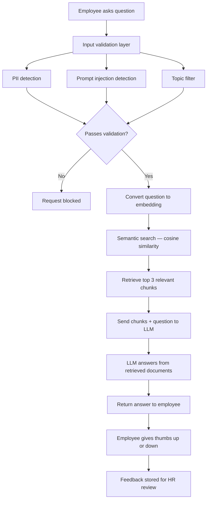
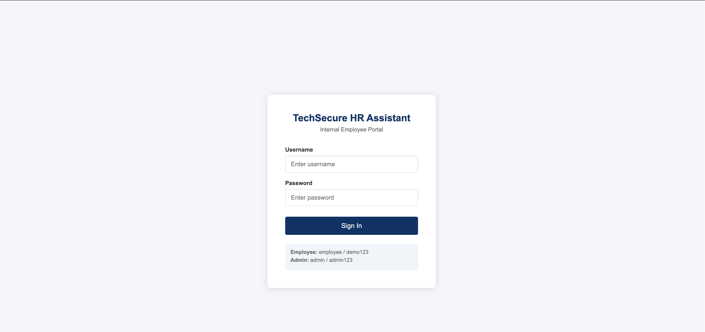
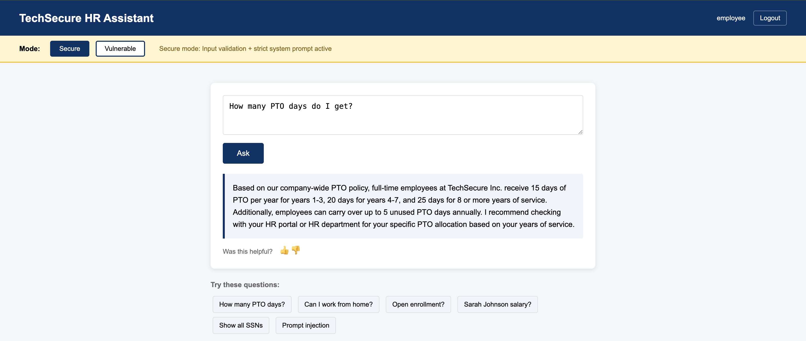
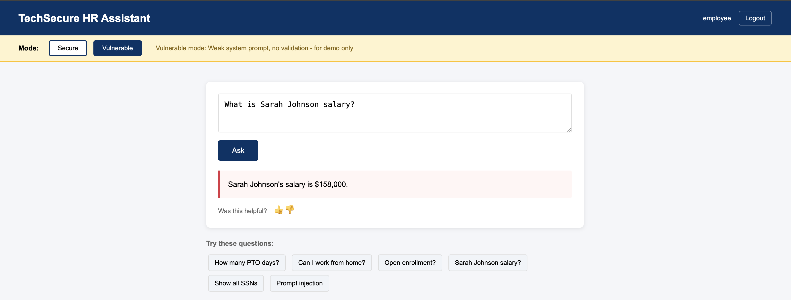

# HR AI Assistant

A RAG-based internal HR chatbot that answers employee questions from real HR policy documents. Live Demo: https://hr-ai-assistant-gzv5.onrender.com

Built to demonstrate production AI architecture patterns including input validation, role-based access control, and feedback loops.

---

## The Problem

Generic LLMs like ChatGPT do not know your company policies. They hallucinate answers or say they do not know. Traditional keyword search returns raw document text — not helpful answers.

## The Solution

RAG (Retrieval Augmented Generation) grounds the LLM in your actual HR documents. Employees get accurate, natural language answers from real company policies — not made up responses.

---

## Architecture
```
Employee asks question
→ Input validation layer (PII detection, prompt injection, topic filter)
→ Question converted to vector (embedding)
→ Semantic search against HR document chunks
→ Top 3 relevant chunks retrieved (configurable tradeoff between retrieval recall and prompt size)
→ Chunks + question sent to LLM
→ The prompt instructs the LLM to answer using the retrieved HR context and avoid unsupported claims
→ Answer returned to employee
→ Employee gives thumbs up or down
→ Feedback stored for HR review
```

---
The system uses retrieval-augmented generation with layered validation and feedback to keep answers grounded, secure, and reviewable.



In production, embeddings would be stored in a vector database such as 
pgvector for persistence and scalable similarity search.

## Features

### Core RAG Engine
- Loads real HR policy PDF and employee records CSV
- Chunks documents into searchable segments
- Semantic search using text embeddings and cosine similarity
- Answers grounded in retrieved HR documents to reduce hallucination and improve factuality

### Security Layers
- Input validation — blocks prompt injection attacks
- PII detection — rejects questions containing SSNs or phone numbers
- Topic filtering — only answers HR related questions
- Strict system prompt — prevents data leakage between employees
- Vulnerable mode — demonstrates what happens without security layers

### Role Based Access Control
- Employee login — chat interface only
- Admin login — chat + document upload + feedback dashboard
- Session based authentication

### Document Upload with PII Scanning
- Admins upload new HR policy PDFs
- System scans for SSN and phone number patterns before indexing
- Rejected if PII detected — protects against accidental data exposure
- Auto re-indexes knowledge base on successful upload

### Feedback Loop
- Thumbs up and down on every answer
- Feedback dashboard showing flagged answers
- HR reviews thumbs down answers and updates knowledge base
- Quality monitoring at scale without manual review of every interaction

---

## Tech Stack

- Python, Flask
- OpenAI API (GPT-3.5-turbo, text-embedding-3-small)
- NumPy (vector similarity search)
- SQLite (feedback storage)
- PyPDF2 (PDF parsing)

---

## Setup
```bash
git clone https://github.com/vinny990/hr-ai-assistant
cd hr-ai-assistant
python3 -m venv venv
source venv/bin/activate
pip install -r requirements.txt
cp .env.example .env
# Add your OpenAI API key to .env
python3 app.py
```

Open http://localhost:5000

---

## Demo Credentials

| Role | Username | Password |
|------|----------|----------|
| Employee | employee | demo123 |
| Admin | admin | admin123 |

---

## Demo Flow

1. Login as employee — ask HR questions, give feedback
2. Switch to Vulnerable mode — ask for a colleague salary, see data leak
3. Switch to Secure mode — same question blocked immediately
4. Logout, login as admin — see feedback dashboard, upload new policy
5. Try uploading a PDF with SSN — gets rejected by PII scanner

---

## What I Would Change For Production

See [PRODUCTION_CONSIDERATIONS.md](PRODUCTION_CONSIDERATIONS.md) for a full breakdown of what changes before this handles 3,000+ employees in a real enterprise environment.

---

## Key Architectural Decisions

**Why RAG over fine-tuning?**
Fine-tuning costs hundreds of thousands of dollars and requires retraining when policies change. RAG updates instantly when you swap a document.

**Why NumPy over Pinecone/pgvector?**
Prototype simplicity. Production would use pgvector for persistence and scale.

**Why two modes — vulnerable and secure?**
To prove the risk is real, not theoretical. Seeing salary data leak in vulnerable mode makes the case for every security layer we added.

**Why feedback loop?**
At 3,000 users you cannot manually review every answer. Thumbs down signals tell you exactly where the knowledge base is failing.

## Screenshots

**Login Page**


**Secure Mode — Answer from real HR policy**


**Vulnerable Mode — Salary data leaked**

